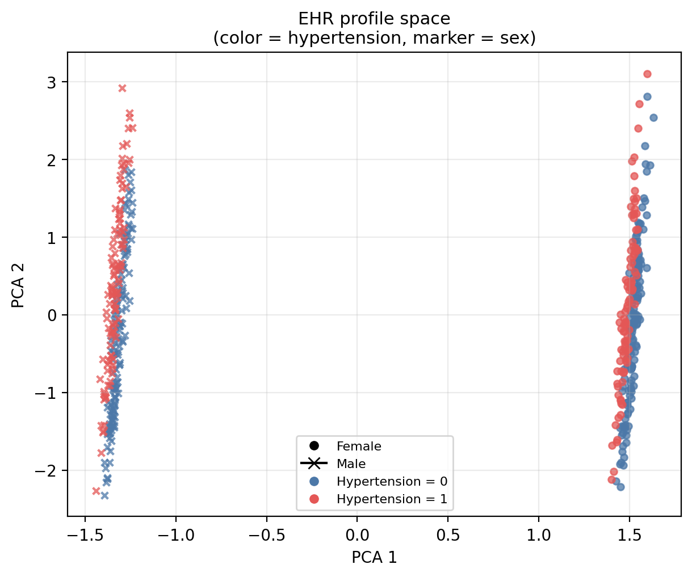
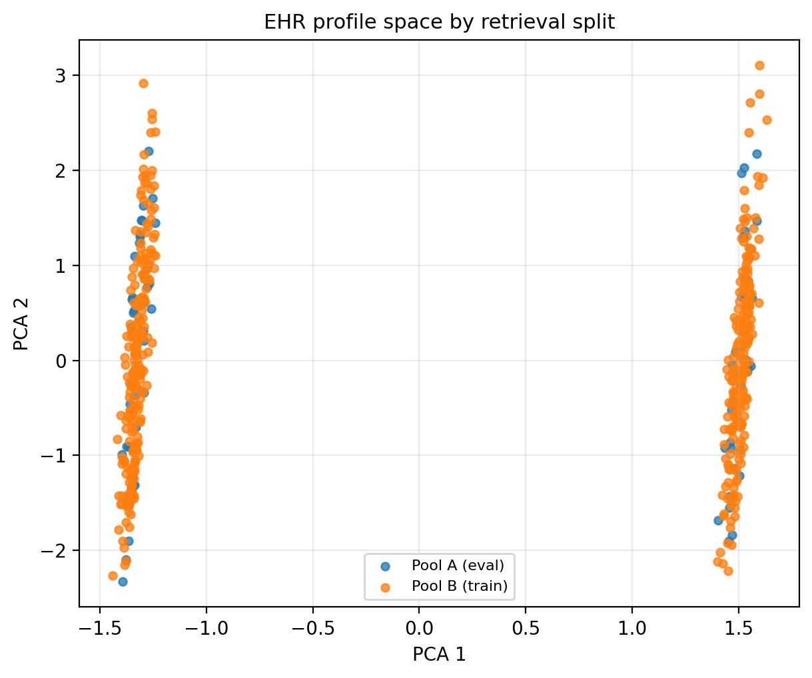
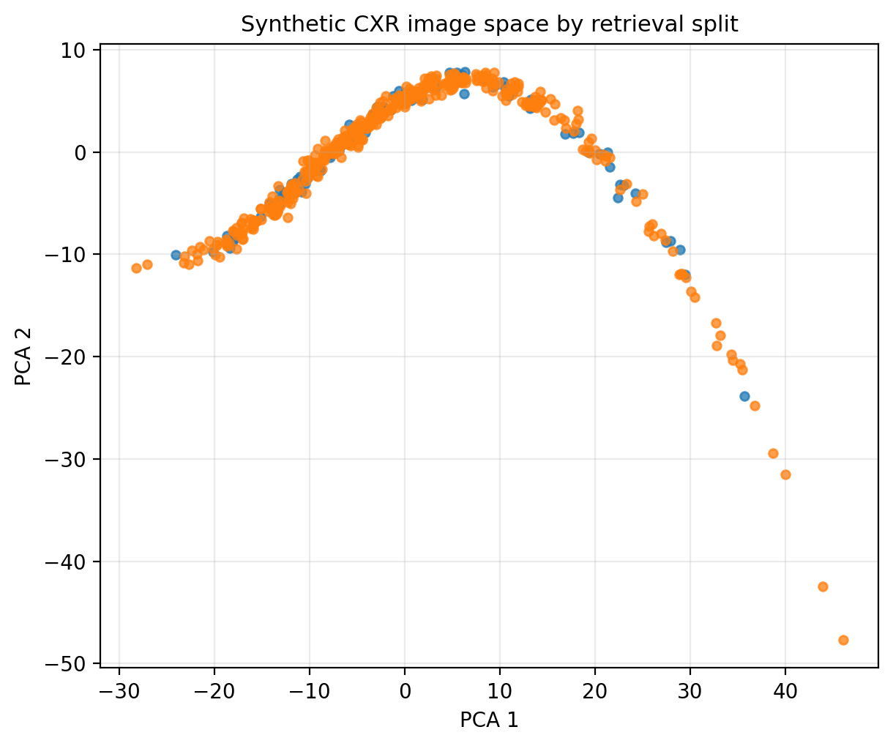

# FT-Transformer EHR Retrieval

A controlled method-study comparing an FT-Transformer-style tabular encoder with a baseline MLP encoder for multimodal retrieval.

The project is inspired by multimodal medical representation learning, but the public version uses controlled synthetic data instead of restricted clinical data. The goal is to study method behavior under known data-generating conditions, not to make clinical claims.

## Research Question

Can an FT-Transformer-style tabular encoder improve retrieval alignment compared with a simpler MLP encoder when the data contains feature interactions, noisy pairings, or larger sample sizes?

## What This Repository Shows

This repository demonstrates:

- how to build a two-tower contrastive retrieval pipeline
- how to compare MLP and FT-Transformer tabular encoders
- how Recall@K and lift-over-random can be used for retrieval evaluation
- how model behavior changes under linear, interaction-based, and noisy-pair synthetic setups
- why higher embedding similarity does not always guarantee better top-k retrieval

## Methods Compared

| Method | Description |
|---|---|
| MLP EHR Encoder | A baseline feed-forward encoder for transformed tabular features |
| FT-Transformer EHR Encoder | A feature-tokenizer + Transformer encoder that applies self-attention over tabular feature tokens |

Both methods use the same symmetric InfoNCE contrastive loss and retrieval evaluation pipeline.

## Related Work

This repository includes an FT-Transformer-style encoder for tabular EHR-like features. The main inspiration is the FT-Transformer approach studied by Gorishniy et al. in *Revisiting Deep Learning Models for Tabular Data*, where feature tokenization and Transformer layers were evaluated as a strong deep learning baseline for tabular prediction tasks.

The broader idea of using Transformer-based architectures for tabular data is also related to TabTransformer, which applies self-attention to learn contextual embeddings for categorical features.

These works motivate the comparison in this repository: a simple MLP encoder is tested against a Transformer-style tabular encoder under controlled retrieval conditions.

## Dataset Setup

The public repository uses controlled synthetic multimodal data.

Three dataset modes are included:

| Setup | Purpose |
|---|---|
| Linear | Tests whether a simple MLP is already sufficient when the signal is mostly linear |
| Interaction | Tests whether FT-Transformer helps when feature interactions matter |
| Noisy | Tests robustness when a fraction of image-EHR pairings are intentionally corrupted |

The generated images are controlled synthetic visual patterns rather than clinical medical images. This makes the benchmark reproducible, privacy-safe, and suitable for method-behavior analysis.

## Experiments

The final benchmark compares:

- encoder type: MLP vs FT-Transformer
- dataset mode: linear, interaction, noisy
- sample size: 500 pilot, 1000, 2000
- training duration: 10 epochs for the main benchmark

Metrics reported:

- Recall@1
- Recall@5
- Recall@10
- Recall@50
- lift over random baseline
- positive-pair cosine similarity
- training loss

## Key Findings

FT-Transformer did not universally outperform the MLP. Its behavior depended on the data setup.

Main observations:

- In linear settings, the MLP was already highly competitive.
- In the 1000-sample interaction setup, FT-Transformer improved retrieval over MLP.
- In noisy-pair settings, both models degraded, showing that better architecture cannot fully compensate for weak pair quality.
- FT-Transformer often improved positive-pair similarity, but higher similarity did not always translate into better top-k retrieval.

The main lesson is that architecture, data structure, sample size, and pairing quality must be evaluated together.

## Demo-space visualization

The figures below show the synthetic input spaces used in this repository. These are **pre-training diagnostics**, not learned embedding visualizations.

<table>
  <tr>
    <td align="center">
      <a href="figures/ehr_profile_space.png">
        
      </a>
      <br/>
      <sub><b>EHR profile space</b></sub>
    </td>
    <td align="center">
      <a href="figures/ehr_pool_split_space.png">
        
      </a>
      <br/>
      <sub><b>EHR train/eval split</b></sub>
    </td>
    <td align="center">
      <a href="figures/cxr_image_space.png">
        
      </a>
      <br/>
      <sub><b>Synthetic CXR image space</b></sub>
    </td>
  </tr>
</table>

These plots are qualitative diagnostics.

- The **EHR profile space** summarizes the synthetic patient table after preprocessing and PCA projection.
- The **EHR split plot** shows how Pool A (evaluation) and Pool B (training) are distributed across the profile space.
- The **synthetic CXR image space** shows the image-side structure before retrieval training.

The main conclusions of the project should still be based on retrieval results and controlled experiments rather than on visual inspection alone.

### How to read the figures

| Panel | What to notice |
|---|---|
| **EHR profile space** | Nearby points represent structurally similar patient profiles in the synthetic tabular feature space. |
| **EHR train/eval split** | Pool A and Pool B should be spread across the same overall space, rather than being isolated into separate regions. |
| **Synthetic CXR image space** | If the image-side distribution shows broad structure rather than pure random scatter, the retrieval task has meaningful input variation to learn from. |

## Repository Structure

```text
ft-transformer-ehr-retrieval/
│
├── src/
│   ├── train.py
│   ├── make_demo_data.py
│   ├── model.py
│   ├── cxr_transforms.py
│   └── ehr_transformer.py
│
├── data_demo/
│   ├── demo_cxr_samples.csv
│   ├── demo_ehr_profiles.csv
│   ├── train_feature_schema.json
│   └── train_transform_stats.json
│
├── docs/
│   ├── method_overview.md
│   ├── experiment_design.md
│   ├── metric_explanation.md
│   └── reproducibility_notes.md
│
├── experiments/
│   └── results_summary.md
│
├── requirements.txt
└── README.md
```

## Quick Start

Install dependencies:

```powershell
pip install -r requirements.txt
```

Generate synthetic data:

```powershell
python src/make_demo_data.py --mode interaction --n-samples 1000
```

Train the MLP baseline:

```powershell
python src/train.py --ehr-encoder mlp --epochs 10 --batch-size 32 --num-workers 0 --output-dir outputs/example_mlp --checkpoint-dir checkpoints/example_mlp
```

Train the FT-Transformer model:

```powershell
python src/train.py --ehr-encoder ftt --epochs 10 --batch-size 32 --num-workers 0 --output-dir outputs/example_ftt --checkpoint-dir checkpoints/example_ftt
```

## Documentation

- [Method overview](docs/method_overview.md)
- [Experiment design](docs/experiment_design.md)
- [Metric explanation](docs/metric_explanation.md)
- [Reproducibility notes](docs/reproducibility_notes.md)
- [Controlled experiment results](experiments/results_summary.md)

## References

- Yury Gorishniy, Ivan Rubachev, Valentin Khrulkov, and Artem Babenko. *Revisiting Deep Learning Models for Tabular Data*. NeurIPS 2021.
- Xin Huang, Ashish Khetan, Milan Cvitkovic, and Zohar Karnin. *TabTransformer: Tabular Data Modeling Using Contextual Embeddings*. arXiv, 2020.

## Limitations

This repository is a controlled method-analysis project rather than a clinical deployment study. The benchmark uses synthetic multimodal data so that the data structure, pairing quality, feature interactions, and sample-size effects can be studied under known conditions.

The visual inputs are controlled synthetic patterns rather than clinical medical images. Therefore, the results should be interpreted as evidence of experimental design, retrieval-evaluation reasoning, and model-behavior analysis, not as clinical performance or diagnostic capability.

A stronger follow-up would include repeated random seeds, longer training, additional sample-size sweeps, and evaluation on authorized real-world datasets under proper data-use restrictions.